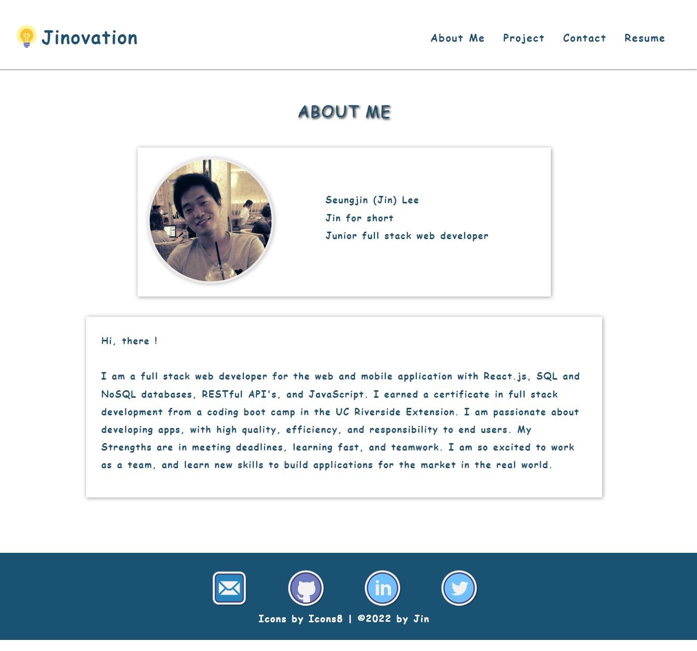

# Jinovation-React-Portfolio

## Description

A portfolio built as a single-page applications by using React.js. This portfolio is composed of about me, project, contact, and resume pages and the application is created for the mobile-first design.

## Built with

- JavaScript
- Node.js
- React.js

## Installation

`npm init`

`npx create-react-app`

## Usage

`npm run start`

## Screenshot

